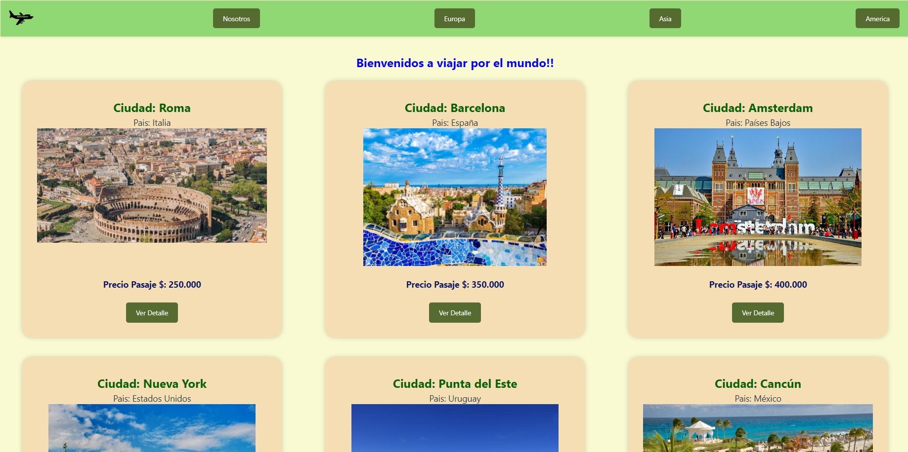
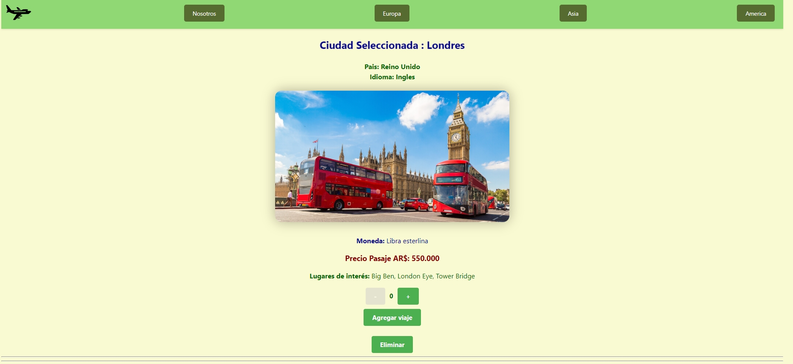
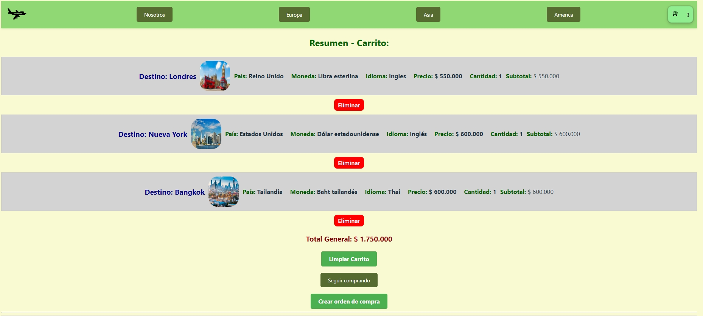
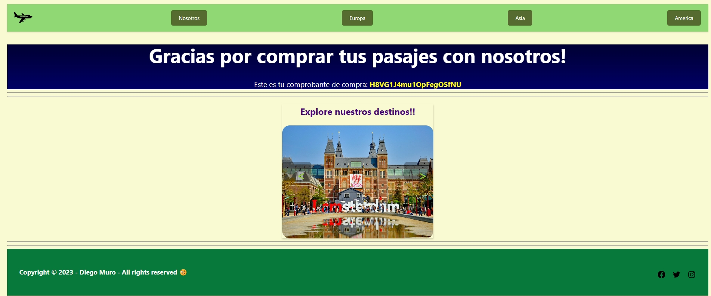

# **Proyecto Final ReactJS CoderHouse 2023** 

[](https://nodesource.com/products/nsolid)

### **Diego Muro**
### **Contacto:**
[](https://www.linkedin.com/in/diego-muro-349210270/)
[](https://github.com/DiegoGMuro)
# *Informacion del proyecto:*

A continuacion una descripcion del proyecto final del curso de ReactJS de  [CoderHouse](https://www.coderhouse.com).
Es sobre un Ecommerce de compra de pasajes para destinos de Europa, Asia y America, el mismo esta desarrollado con Vite.
Para el guardado de los datos se utilizo Firebase tanto para las colecciones de productos como las de ordenes.


## *Version Deployada en VERCEL:*
Link a Vercel del proyecto: 
- [](https://entrega-final-react-js-diego-muro.vercel.app/)


**Pantallas de la App:**

### 1. Pantalla principal:
## 

### 2. Detalle de Ciudad seleccionada:

## 

### 3. Carrito de compras con Ciudades seleccionadas:

## 

### 5. Compra finalizada exitosamente:

## 

# Para poder usar el proyecto

### Seguir los siguientes pasos:

- Clonar el repositorio de GitHub:

  ```bash
  git clone https://github.com/DiegoGMuro/Entrega_Final-ReactJS_Diego_Muro.git
  ```

- Instalar dependencias para VITE:
  ```bash
  npm create vite@latest
  npm install
    ```

- Instalar dependencias en general:
  ```bash
  npm install bootstrap
  npm install @popperjs/core
  npm install @fortawesome/react-fontawesome @fortawesome/free-solid-svg-icons
  npm i @fortawesome/fontawesome-svg-core @fortawesome/free-solid-svg-icons  @fortawesome/free-regular-svg-icons @fortawesome/react-fontawesome@latest
  npm install react-router-dom
  npm install react - hook - form
  npm install sweetalert2
  npm install firebase
  ```


- Para correr el proyecto:

  ```bash
  npm run dev
  ```


PUSHEAR
https://github.com/DiegoGMuro/Entrega_Final-ReactJS_Diego_Muro.git


